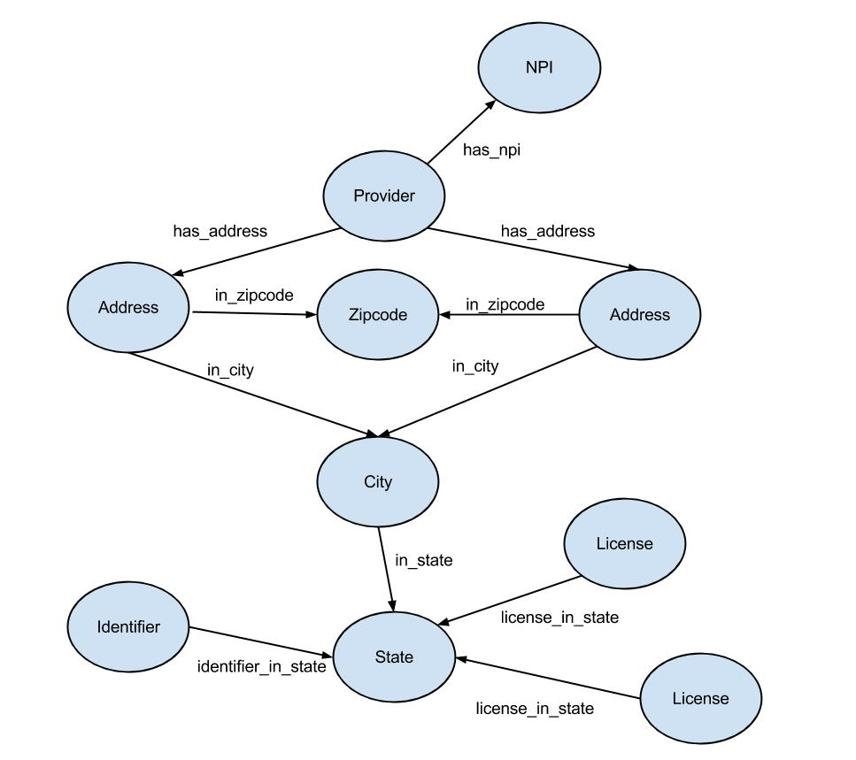

# NPI in Neo4j

## Description
A python library for loading the National Provider Identifier Registry
into a Neo4j graph database.

## Usage
The registry can be loaded from the command line with the following
command,

    python loader.py <path-to-npi-file.csv> <neo4j-url>

## Example Provider Subgraph

